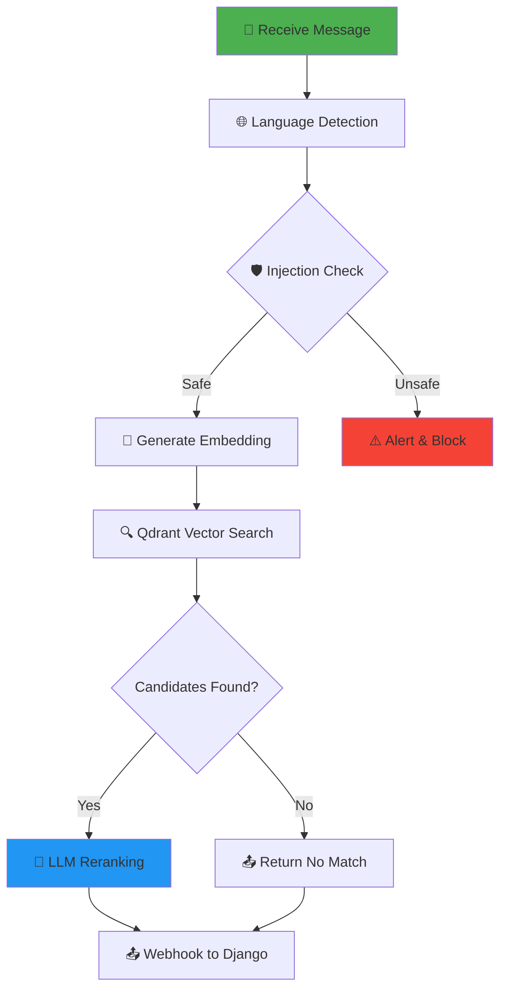

# CivicConnect AI Microservice

<div align="center">

**Intelligent Citizen Request Routing System**

A dual-implementation AI microservice designed to intelligently route citizen requests to appropriate government departments using semantic understanding and LLM-powered classification.

[![Java](https://img.shields.io/badge/Java-11+-ED8B00?style=for-the-badge&logo=data:image/svg+xml;base64,PHN2ZyByb2xlPSJpbWciIHZpZXdCb3g9IjAgMCAyNCAyNCIgeG1sbnM9Imh0dHA6Ly93d3cudzMub3JnLzIwMDAvc3ZnIj48dGl0bGU+T3BlbkpESzwvdGl0bGU+PHBhdGggZmlsbD0id2hpdGUiIGQ9Ik0xMS4zNTQgMi4wMDdWMTcuNTNoNy4xNTV2LTMuOTU2aC0zLjE5OFYyLjAwN3ptLTUuMzAzIDE1LjI1NmMtLjkxNS0uNjgtMS42MjYtMS4yODctMi4zMy0yLjMzYTcuOCA3LjggMCAwIDEtMS42NjgtNC4xNjdjMC0xLjk4LjY3LTMuODM0IDEuOTA1LTUuMzc2Qy0uNjc5IDguMDU1LjAwOSAxMi43MzguMDA5IDE0LjYzNmMwIDMuMDQ3IDEuMDggNS42MDYgMi4zOTEgNy43MzYgMS4wNDEgMS42OTEgMi4yODYgMy4xMjggMy43MTcgNC4zMTVsLjQzNC0uNDIzYTI0IDI0IDAgMCAxLTIuNzQ1LTMuNzk0YTEzLjU1IDEzLjU1IDAgMCAxLTEuNzU1LTUuMjA3bTUuMDMgNi4zNzNjLjI3MS4yMDQuNTYxLjQwNS44NjMuNiAxLjI0Ljc5OCAyLjQ4MyAxLjI5OCAzLjY5MiAxLjQ5M2E2LjkgNi45IDAgMCAwIDMuNTI4LS42NzIgNS43MyA1LjczIDAgMCAwIDIuNjI4LTIuNzIxIDEwLjQgMTAuNCAwIDAgMCAuNzY2LTIuMzg1bC0uMDUzLS44MDdjLS40NzggMS4xODMtMS4yOSAyLjMxNi0yLjM0OCAzLjI4NGE4LjMgOC4zIDAgMCAxLTMuODY1IDEuODIybC4wMDUtLjAwNWMtLjc0NC4xMDctMS43MTYuMDgtMi45MDkuMDUzYTEzLjggMTMuOCAwIDAgMS0yLjMwNy0uNjYyIi8+PC9zdmc+&logoColor=white)](https://openjdk.org/)
[![Spring Boot](https://img.shields.io/badge/Spring%20Boot-2.7.18-6DB33F?style=for-the-badge&logo=data:image/svg+xml;base64,PHN2ZyByb2xlPSJpbWciIHZpZXdCb3g9IjAgMCAyNCAyNCIgeG1sbnM9Imh0dHA6Ly93d3cudzMub3JnLzIwMDAvc3ZnIj48dGl0bGU+U3ByaW5nIEJvb3Q8L3RpdGxlPjxwYXRoIGZpbGw9IndoaXRlIiBkPSJNMjMuNjkzIDEwLjcwNmwtNC4yMTQgNC4yMTRjMS40NTUgMi4xMjcgMi41MDkgNC40NTkgMy4xMzEgNi45MjJsLjAwMi4wMDh2LjAwMmEuNDcuNDcgMCAwIDEtLjEyNy4zNjcuNDguNDggMCAwIDEtLjM1NC4xMjdoLS4wMTZjLTIuNDgyLS42MzctNC44My0xLjY5OS02Ljk2OS0zLjE1OUwxMS45MyAyMy40YS45ODMuOTgzIDAgMCAxLTEuMzk0IDBsLTQuMjIzLTQuMjIzYy0yLjEyOCAxLjQ1NS00LjQ2IDIuNTEtNi45MjIgMy4xMzJhLjQ2OS40NjkgMCAwIDEtLjM2NS0uMTI2LjQ3OC40NzggMCAwIDEtLjEzLS4zNjljLjYyMy0yLjQ2MiAxLjY3Ny00Ljc5NCAzLjEzMi02LjkyMkwuMzA3IDEzLjE3YS45ODMuOTgzIDAgMCAxIDAtMS4zOTRMMTAuNTM2IDEuNTQ3YS45ODMuOTgzIDAgMCAxIDEuMzk0IDBsMy40NiAzLjQ2YS40OC40OCAwIDAgMS0uMDg1Ljc2Mi40ODIuNDgyIDAgMCAxLS41OTEtLjA4NkwxMS45MyAyLjl2LjAwMmwtLjY5Ny42OTd2LjAwMmwuNjk3LS42OTdMMy43MDYgMTEuMTI4bC0uNjk3LjY5N3YuMDAybC42OTctLjY5NyA4LjIyNCA4LjIyNHYtLjAwMmwuNjk3LjY5N3YuMDAybC0uNjk3LS42OTcgOC4yMjQtOC4yMjRhLjQ4LjQ4IDAgMCAxIC42ODIgMCAuNDg2LjQ4NiAwIDAgMSAwIC42ODRsLTQuMjIzIDQuMjIzYy0uNDk0LS4yOS0uOTc2LS42MDEtMS40NDMtLjkyOWExNC4zMjcgMTQuMzI3IDAgMCAxLTMuMjgzLTMuMzExIDEwLjQ0NyAxMC40NDcgMCAwIDEtMS4wNDEtMS42NjljLS4zMS0uNjMtLjU2Ni0xLjI4Ny0uNzY0LTEuOTYyYTE0LjMxIDE0LjMxIDAgMCAxLS41NTMtNC4zNyAxNC4zMTMgMTQuMzEzIDAgMCAxIDMuMTMtNi41ODguNDgzLjQ4MyAwIDAgMSAuNzgxLjU2NSAxMy4zNTQgMTMuMzU0IDAgMCAwLTIuOTIyIDYuMTI0Yy0uMjI1IDEuMzg5LS4yNCAyLjgwMy0uMDQ1IDQuMTkzdi4wMDJjLjE3OCAxLjI4Mi41MjMgMi41MzYgMS4wMjQgMy43MjUuMjYzLjYyNS41NzggMS4yMjUuOTQgMS43OTlhMTMuNDQ4IDEzLjQ0OCAwIDAgMCAzLjA2MyAzLjA2M2MuNTc0LjM2MSAxLjE3NC42NzcgMS43OTguOTQgMS4xLjQ2MiAyLjI1OS43ODQgMy40NC45NzMgMS4xNTcuMTg0IDIuMzMzLjIxOSAzLjQ5LjEwNGE4LjY0OSA4LjY0OSAwIDAgMCAxLjI2LS4yMTQuNDc2LjQ3NiAwIDAgMSAuMzY3LjEyNy40OS40OSAwIDAgMSAuMTI2LjM4NGMtLjYyMiAyLjQ2Mi0xLjY3NyA0Ljc5NC0zLjEzMiA2LjkyMnoiLz48L3N2Zz4=&logoColor=white)](https://spring.io/projects/spring-boot)
[![Python](https://img.shields.io/badge/Python-3.10+-3776AB?style=for-the-badge&logo=data:image/svg+xml;base64,PHN2ZyByb2xlPSJpbWciIHZpZXdCb3g9IjAgMCAyNCAyNCIgeG1sbnM9Imh0dHA6Ly93d3cudzMub3JnLzIwMDAvc3ZnIj48dGl0bGU+UHl0aG9uPC90aXRsZT48cGF0aCBmaWxsPSJ3aGl0ZSIgZD0iTTE0LjI1LjE4bC45LjIuNzMuMjYuNTkuMy40NS4zMi4zNC4zNC4yNS4zNGEyLjggMi44IDAgMCAxIC4xNC4zM2wuMDUuMjlMLTE3LjMwNDQ1di01LjQwNGMwLTEuODY2LjE0LTIuNjIzLjQxLTMuMzI0LjI3LS43LjY1LTEuMjMgMS4xNS0xLjcuNS0uNDcgMS4wMi0uOCAxLjc1LTEuMDQuNzItLjI1IDEuNDUtLjM3IDMuMy0uMzdoMy4wM2MxLjE3IDAgMS44NS4wNSAyLjM0LjE2em00LjczOCAxMS44MTRhMi4yIDIuMiAwIDAgMC0uNDItLjQxIDMuMSAzLjEgMCAwIDAtLjU3LS4zNWwtLjcyLS4yNi0uODUtLjE2aC01LjE5MWwtLjYtLjA0LS40OC0uMTItLjM3LS4xOS0uMjgtLjI2LS4xOC0uMjctLjEtLjMtLjA0LS4yOVY1LjVsLjEtLjYzLjI0LS41NS4zNy0uNDIuNDgtLjMyLjU4LS4yMy42NS0uMTQuNzItLjA1aDQuNjlsLjYuMDQuNDguMTIuMzcuMTkuMjguMjYuMTguMjcuMS4zLjA0LjI5djMuNzVsLS4wNC4yOC0uMS4zLS4xOC4yNy0uMjguMjYtLjM3LjE5LS40OC4xMi0uNi4wNEgxNS42bC0uNjUtLjE0LS41OC0uMjMtLjQ4LS4zMi0uMzctLjQyLS4yNC0uNTUtLjEtLjYzdi00LjQ3bC4wNC0uMjguMS0uMjkuMTgtLjI3LjI4LS4yNi4zNy0uMTkuNDgtLjEyLjYtLjA0em0tNi4xMTYgMy41NDJhLjgyLjgyIDAgMCAwLS4xNDYuMTk4Ljc2Ljc2IDAgMCAwLS4wNi4yMjguNzYuNzYgMCAwIDAgLjA0NS4yNjcuNzQuNzQgMCAwIDAgLjE0NS4yMzguNzcuNzcgMCAwIDAgLjIxNC4xNzQuNzguNzggMCAwIDAgLjI2NS4wOS43NS43NSAwIDAgMCAuMjc1LS4wMi43OC43OCAwIDAgMCAuMjYtLjEzLjc2Ljc2IDAgMCAwIC4xOC0uMjEzLjcxLjcxIDAgMCAwIC4wODUtLjI2Ny43Mi43MiAwIDAgMC0uMDI1LS4yNzUuNzQuNzQgMCAwIDAtLjEyNS0uMjQ2Ljc4Ljc4IDAgMCAwLS4yMDYtLjE5NC43Ny43NyAwIDAgMC0uMjYtLjEyNS43OC43OCAwIDAgMC0uMjktLjAzNi43Ni43NiAwIDAgMC0uMjguMDY1eiIvPjxwYXRoIGZpbGw9IndoaXRlIiBkPSJNOS44MyAyMy44MmwtLjktLjItLjczLS4yNi0uNTktLjMtLjQ1LS4zMi0uMzQtLjM0LS4yNS0uMzRhMi44IDIuOCAwIDAgMS0uMTQtLjMzbC0uMDUtLjI5TDYuNjk1NTV2NS40MDRjMCAxLjg2Ni0uMTQgMi42MjMtLjQxIDMuMzI0LS4yNy43LS42NSAxLjIzLTEuMTUgMS43LS41LjQ3LTEuMDIuOC0xLjc1IDEuMDQtLjcyLjI1LTEuNDUuMzctMy4zLjM3SDMuNTI1NWMtMS4xNyAwLTEuODUtLjA1LTIuMzQtLjE2ek00LjM0MSAxMi4wMDZhMi4yIDIuMiAwIDAgMCAuNDIuNDEgMy4xIDMuMSAwIDAgMCAuNTcuMzVsLjcyLjI2Ljg1LjE2aDUuMTkxbC42LjA0LjQ4LjEyLjM3LjE5LjI4LjI2LjE4LjI3LjEuMy4wNC4yOXY0LjQ3bC0uMS42My0uMjQuNTUtLjM3LjQyLS40OC4zMi0uNTguMjMtLjY1LjE0LS43Mi4wNUg2LjM4NWwtLjYtLjA0LS40OC0uMTItLjM3LS4xOS0uMjgtLjI2LS4xOC0uMjctLjEtLjMtLjA0LS4yOXYtMy43NWwuMDQtLjI4LjEtLjMuMTgtLjI3LjI4LS4yNi4zNy0uMTkuNDgtLjEyLjYtLjA0aDQuNjA1bC42NS4xNC41OC4yMy40OC4zMi4zNy40Mi4yNC41NS4xLjYzdjQuNDdsLS4wNC4yOC0uMS4yOS0uMTguMjctLjI4LjI2LS4zNy4xOS0uNDguMTItLjYuMDR6bTYuMTE2LTMuNTQyYS44Mi44MiAwIDAgMCAuMTQ2LS4xOTguNzYuNzYgMCAwIDAgLjA2LS4yMjguNzYuNzYgMCAwIDAtLjA0NS0uMjY3Ljc0Ljc0IDAgMCAwLS4xNDUtLjIzOC43Ny43NyAwIDAgMC0uMjE0LS4xNzQuNzguNzggMCAwIDAtLjI2NS0uMDkuNzUuNzUgMCAwIDAtLjI3NS4wMi43OC43OCAwIDAgMC0uMjYuMTMuNzYuNzYgMCAwIDAtLjE4LjIxMy43MS43MSAwIDAgMC0uMDg1LjI2Ny43Mi43MiAwIDAgMCAuMDI1LjI3NS43NC43NCAwIDAgMCAuMTI1LjI0Ni43OC43OCAwIDAgMCAuMjA2LjE5NC43Ny43NyAwIDAgMCAuMjYuMTI1Ljc4Ljc4IDAgMCAwIC4yOS4wMzYuNzYuNzYgMCAwIDAgLjI4LS4wNjV6Ii8+PC9zdmc+&logoColor=white)](https://python.org/)
[](https://fastapi.tiangolo.com/)

</div>

---

## 📖 Overview

CivicConnect AI is a government-oriented microservice that processes citizen messages, understands their intent, and routes them to the most relevant department. It combines **semantic vector search** with **large language model reasoning** to achieve accurate, explainable routing decisions.

The project provides **two parallel implementations** (Python/FastAPI and Java/Spring Boot) of the same AI pipeline, enabling flexibility in deployment based on infrastructure preferences.

---

## ✨ Key Features

| Feature | Description |
|---------|-------------|
| 🔍 **Semantic Search** | Uses Qdrant vector database with Google's text-embedding-004 model for similarity matching |
| 🤖 **LLM Reranking** | Gemini 2.0 Flash analyzes candidates and selects the best department with reasoning |
| 🌐 **Multi-Language** | Automatic language detection (Uzbek, Russian) with language-filtered search |
| 🛡️ **Injection Detection** | Identifies and blocks potential prompt injection attempts |
| 📊 **Telemetry** | Tracks processing time, token usage, and confidence scores |
| 🔄 **Correction Learning** | Self-improves by learning from manual routing corrections |
| ⚡ **Async Processing** | Non-blocking architecture with webhook callbacks to Django backend |

---

## 🏗️ Architecture

```
┌─────────────────────────────────────────────────────────────────────────┐
│                         CivicConnect Ecosystem                          │
├─────────────────────────────────────────────────────────────────────────┤
│                                                                         │
│  ┌─────────────┐     ┌───────────────────────────────────────────────┐ │
│  │   Django    │────▶│        AI Microservice (Port 8001)            │ │
│  │   Backend   │◀────│  ┌─────────────┐  OR  ┌─────────────────────┐ │ │
│  │  (Port 8000)│     │  │   FastAPI   │      │   Spring Boot       │ │ │
│  └─────────────┘     │  │   (Python)  │      │   (Java)            │ │ │
│         │            │  └─────────────┘      └─────────────────────┘ │ │
│         │            └──────────────────────────────────────────────┬┘ │
│         │                         │                                  │  │
│         │                         ▼                                  │  │
│         │            ┌───────────────────────────────────────────────┤ │
│         │            │              External Services                │ │
│         │            │  ┌──────────────┐    ┌──────────────────────┐│ │
│         │            │  │   Qdrant     │    │   Google Gemini API  ││ │
│         │            │  │   Vector DB  │    │   (Embeddings + LLM) ││ │
│         │            │  │  (Port 6333) │    └──────────────────────┘│ │
│         │            │  └──────────────┘                            │ │
│         │            └───────────────────────────────────────────────┘ │
└─────────────────────────────────────────────────────────────────────────┘
```

---

## 🔄 AI Pipeline Flow

The microservice follows a 6-step pipeline to process each citizen message:



### Pipeline Steps

| Step | Name | Description |
|------|------|-------------|
| 1 | **Language Detection** | Detects Cyrillic (Russian) vs Latin (Uzbek) script |
| 2 | **Injection Detection** | Scans for malicious prompt injection patterns |
| 3 | **Vector Embedding** | Converts text to 768-dimensional vector via Gemini |
| 4 | **Semantic Search** | Queries Qdrant for top-3 similar departments by language |
| 5 | **LLM Reranking** | Gemini analyzes intent and selects best match with reasoning |
| 6 | **Webhook Callback** | Sends structured result to Django backend |

---

## 📁 Project Structure

```
pet_project_java/
├── 📂 fastapi_microservice/          # Python Implementation
│   ├── main.py                       # FastAPI application entry
│   ├── requirements.txt              # Python dependencies
│   ├── 📂 api/
│   │   └── 📂 v1/
│   │       ├── routes.py             # API endpoints
│   │       └── models.py             # Pydantic request/response models
│   └── 📂 services/
│       └── ai_pipeline.py            # Core AI processing logic
│
├── 📂 java_microservice/             # Java Implementation
│   ├── pom.xml                       # Maven dependencies
│   └── 📂 src/main/
│       ├── 📂 java/com/civicconnect/ai/
│       │   ├── Application.java      # Spring Boot entry
│       │   ├── 📂 controller/
│       │   │   └── V1Controller.java # REST endpoints
│       │   ├── 📂 service/
│       │   │   └── AiPipelineService.java  # Core AI logic
│       │   ├── 📂 dto/               # Data transfer objects
│       │   └── 📂 config/
│       │       └── AppConfig.java    # Thread pool & WebClient
│       └── 📂 resources/
│           └── application.properties # Configuration
│
└── README.md                         # This file
```

---

## 🚀 Getting Started

### Prerequisites

- **Qdrant** vector database running on port 6333
- **Google Gemini API Key** for embeddings and LLM
- **Django Backend** running on port 8000 (for webhook callbacks)

### Environment Variables

Create a `.env` file or set these environment variables:

```env
GEMINI_API_KEY=your_gemini_api_key_here
QDRANT_HOST=localhost
QDRANT_PORT=6333
DJANGO_BACKEND_URL=http://127.0.0.1:8000
```

---

### Option A: FastAPI (Python)

```bash
# Navigate to FastAPI directory
cd fastapi_microservice

# Create virtual environment
python -m venv venv

# Activate virtual environment
# Windows:
venv\Scripts\activate
# Linux/Mac:
source venv/bin/activate

# Install dependencies
pip install -r requirements.txt

# Run the server
python main.py
```

The server will start at `http://127.0.0.1:8001`

---

### Option B: Spring Boot (Java)

```bash
# Navigate to Java directory
cd java_microservice

# Build with Maven
mvn clean package -DskipTests

# Run the application
java -jar target/ai-microservice-1.0.0.jar
```

Or use Maven directly:

```bash
mvn spring-boot:run
```

The server will start at `http://127.0.0.1:8001`

---

## 📡 API Reference

### Base URL
```
http://localhost:8001/api/v1
```

### Endpoints

#### `POST /analyze`

Analyze a citizen message and route it to appropriate department.

**Request Body:**
```json
{
  "session_uuid": "550e8400-e29b-41d4-a716-446655440000",
  "message_uuid": "6ba7b810-9dad-11d1-80b4-00c04fd430c8",
  "text": "Мой паспорт поврежден, как получить новый?",
  "settings": {
    "model": "gemini-2.0-flash-001",
    "temperature": 0.2,
    "max_tokens": 500
  }
}
```

**Response (Immediate):**
```json
{
  "status": "processing",
  "message_uuid": "6ba7b810-9dad-11d1-80b4-00c04fd430c8"
}
```

**Webhook Payload (Async to Django):**
```json
{
  "session_uuid": "550e8400-e29b-41d4-a716-446655440000",
  "message_uuid": "6ba7b810-9dad-11d1-80b4-00c04fd430c8",
  "processing_time_ms": 1250,
  "language_detected": "ru",
  "intent_label": "Talab",
  "suggested_department_id": "uuid-of-department",
  "suggested_department_name": "Passport Office",
  "confidence_score": 87,
  "reason": "Request is about damaged passport replacement",
  "embedding_tokens": 15,
  "prompt_tokens": 450,
  "total_tokens": 520,
  "vector_search_results": [...]
}
```

---

#### `POST /train-correction`

Submit a correction to improve future routing accuracy.

**Request Body:**
```json
{
  "text": "Хочу установить забор вокруг дома",
  "correct_department_id": "uuid-of-correct-department",
  "language": "ru"
}
```

**Response:**
```json
{
  "status": "success"
}
```

---

## ⚙️ Configuration Reference

### Python (environment variables)

| Variable | Default | Description |
|----------|---------|-------------|
| `GEMINI_API_KEY` | - | Google Gemini API key (required) |
| `QDRANT_HOST` | `localhost` | Qdrant server hostname |
| `QDRANT_PORT` | `6333` | Qdrant HTTP port |
| `DJANGO_BACKEND_URL` | `http://127.0.0.1:8000` | Django backend for webhooks |

### Java (application.properties)

| Property | Default | Description |
|----------|---------|-------------|
| `gemini.api.key` | - | Google Gemini API key |
| `qdrant.host` | `localhost` | Qdrant server hostname |
| `qdrant.port` | `6334` | Qdrant gRPC port |
| `django.backend.url` | `http://127.0.0.1:8000` | Django backend URL |
| `server.port` | `8001` | Service port |

---

## 🐳 Docker Deployment

For containerized deployment, set these environment variables in your `docker-compose.yml`:

```yaml
services:
  ai-microservice:
    build: ./fastapi_microservice  # or java_microservice
    environment:
      - GEMINI_API_KEY=${GEMINI_API_KEY}
      - QDRANT_HOST=qdrant
      - QDRANT_PORT=6333
      - DJANGO_BACKEND_URL=http://django_backend:8000
    ports:
      - "8001:8001"
    depends_on:
      - qdrant
      
  qdrant:
    image: qdrant/qdrant:latest
    ports:
      - "6333:6333"
      - "6334:6334"
    volumes:
      - qdrant_storage:/qdrant/storage

volumes:
  qdrant_storage:
```

---

## 🔧 Development

### Running Tests

**Python:**
```bash
cd fastapi_microservice
pytest tests/
```

**Java:**
```bash
cd java_microservice
mvn test
```

### Code Quality

The codebase follows these conventions:
- **Python**: PEP 8, type hints, async/await patterns
- **Java**: Spring Boot best practices, Lombok for boilerplate reduction

---

## 📊 Telemetry & Monitoring

The service logs detailed telemetry for each request:

```
2024-01-15 10:23:45 - ai_pipeline - INFO - --- START PIPELINE: uuid-123 ---
2024-01-15 10:23:45 - ai_pipeline - INFO - Step 1 [Lang Detect]: Detected 'ru'
2024-01-15 10:23:45 - ai_pipeline - INFO - Step 2 [Injection]: Is Injection? False (Risk: 0.0)
2024-01-15 10:23:46 - ai_pipeline - INFO - Step 3 [Embedding]: Success. Vector length: 768
2024-01-15 10:23:46 - ai_pipeline - INFO - Step 4 [Search]: Found 3 hits.
2024-01-15 10:23:47 - ai_pipeline - INFO - Step 5 [LLM]: Suggested Dept: uuid-dept
2024-01-15 10:23:47 - ai_pipeline - INFO - --- END PIPELINE: uuid-123 ---
```

---

## 🛡️ Security Considerations

1. **Prompt Injection Protection**: The service scans for known injection patterns before processing
2. **API Key Security**: Store `GEMINI_API_KEY` securely, never commit to version control
3. **Rate Limiting**: Implement rate limiting at the API gateway level for production
4. **Input Validation**: All inputs are validated through Pydantic (Python) or Jackson (Java)

---

## 📝 License

This project is part of the CivicConnect platform. Please refer to the main project license for usage terms.

---

## 🤝 Contributing

Contributions are welcome! Please ensure:

1. Code follows existing style conventions
2. Tests pass for both implementations
3. Documentation is updated for any API changes